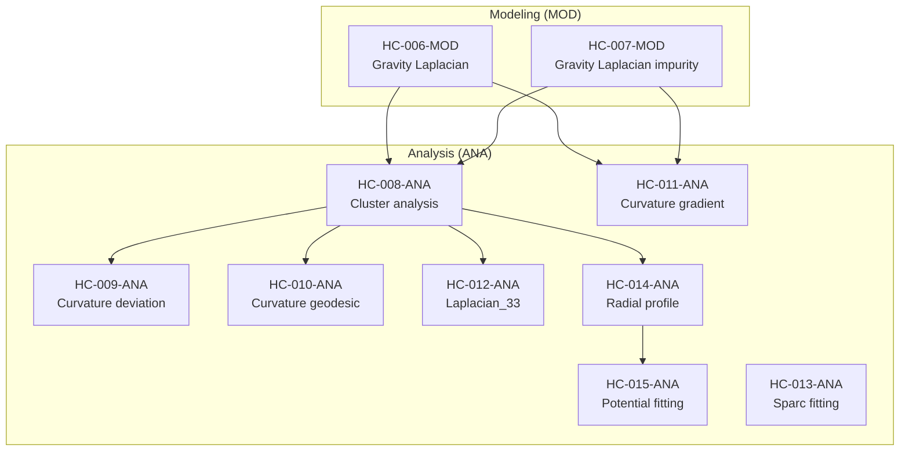

# HoloCosmo Modeling & Analysis Workflow

This diagram shows the end-to-end dependency flow between simulation (MOD) scripts and analysis (ANA) scripts in the HoloCosmo project.

- **MOD scripts** generate raw PEPS-based entanglement curvature data.
- **ANA scripts** perform clustering, curvature visualizations, geodesic tracing, radial profiling, and potential fitting.

